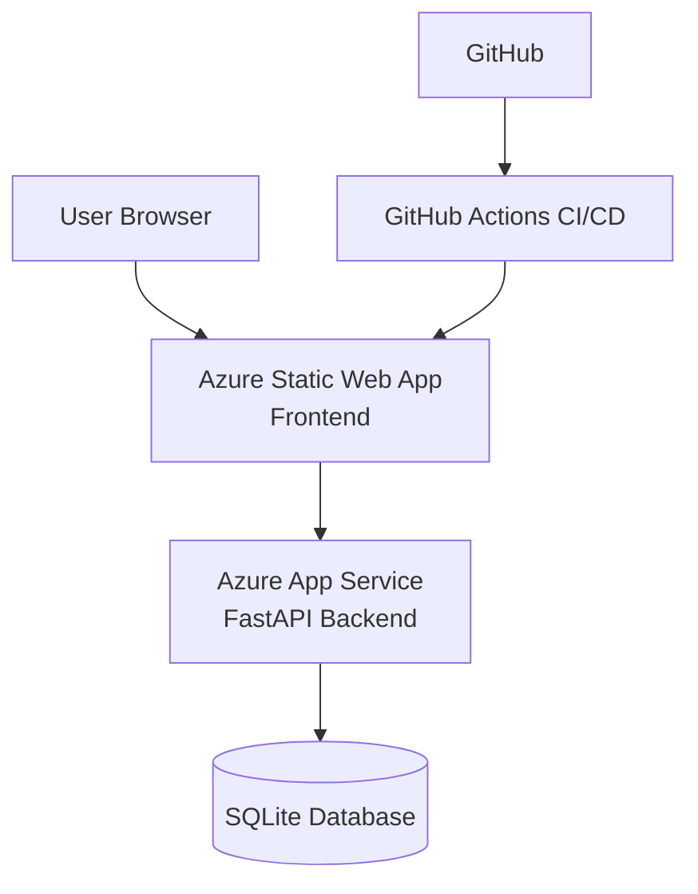

# Azure Secure 3-Tier Medical Portal (Simulation)

[](https://github.com/Kethanx/azure-medical-3tier-portal/actions/workflows/azure-static-web-apps-gentle-beach-0cb50520f.yml)

## Overview

This project simulates a secure healthcare-style web application deployed on Microsoft Azure.

It demonstrates a production-style 3-tier cloud architecture:

- Frontend hosted on Azure App Service
- Backend API hosted on Azure App Service
- Azure SQL Database for data storage
- Azure Key Vault for secrets management
- Virtual Network design with private connectivity
- Monitoring with Azure Monitor and Application Insights
- Cost awareness through Azure budgeting and tagging

> Note: This project uses synthetic data only. No real patient data is involved.

---

## Project Status


---

## Planned Architecture

- **Frontend:** Azure App Service
- **Backend API:** Azure App Service
- **Database:** Azure SQL Database
- **Secrets:** Azure Key Vault
- **Networking:** Azure Virtual Network, subnets, private endpoints
- **Monitoring:** Azure Monitor, Application Insights
- **Governance:** Resource groups, tagging, cost budgets

---

## Repository Structure

```bash
azure-medical-3tier-portal/
├── docs/          project documentation and screenshots
├── infra/         future infrastructure as code
└── src/
    ├── api/       FastAPI backend service
    └── frontend/  HTML/CSS/JavaScript dashboard
```

## Cloud Stack

- Azure Static Web Apps
- Azure App Service
- FastAPI
- GitHub Actions
- SQLite
- HTML / CSS / JavaScript

## Project Roadmap

### Phase 1 – Core Deployment

- Create Azure Resource Group
- Deploy Frontend and Backend with App Service
- Deploy Azure SQL Database
- Connect application tiers

### Phase 2 – Security and Networking

- Implement Azure Virtual Network
- Configure private endpoint for Azure SQL
- Add Azure Key Vault
- Configure managed identity

### Phase 3 – Observability and Governance

- Enable Application Insights
- Configure Azure Monitor
- Implement cost budgets and alerts

## Architecture Diagram


