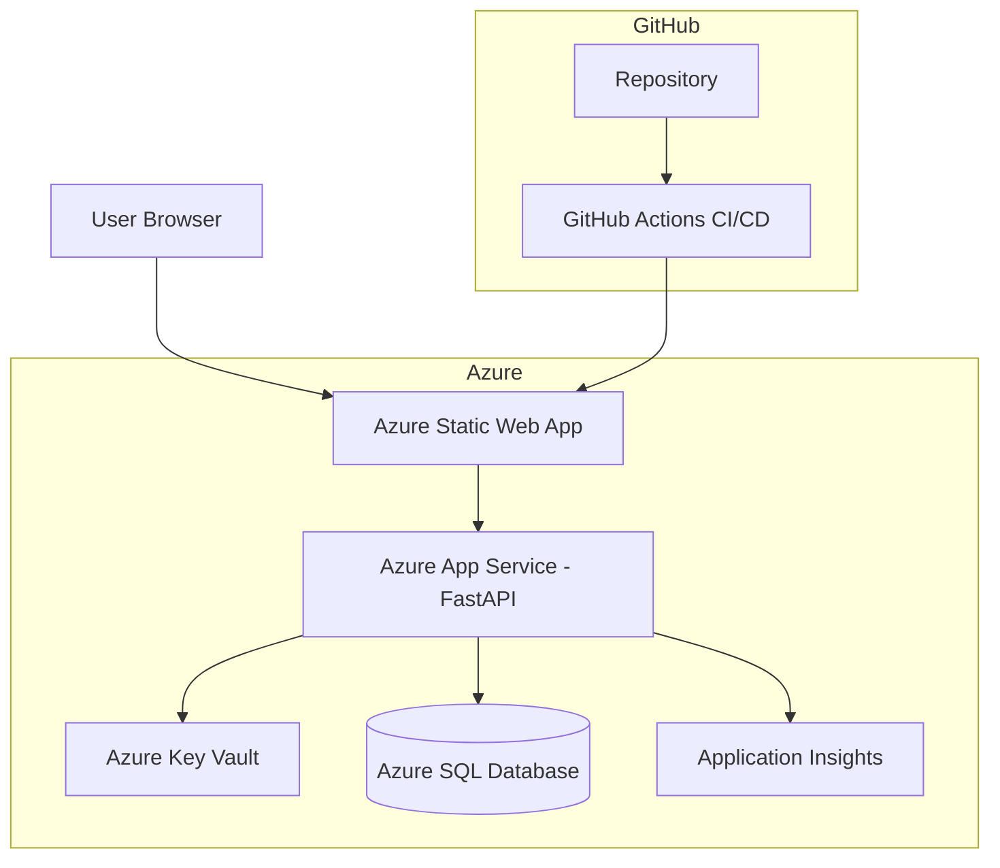

# Azure Secure 3-Tier Medical Portal (Cloud Simulation)


[](https://github.com/Kethanx/azure-medical-3tier-portal/actions/workflows/azure-static-web-apps-gentle-beach-0cb50520f.yml)

---

# Overview

This project simulates a secure healthcare-style cloud application deployed on Microsoft Azure.

It demonstrates a production-style 3-tier cloud architecture:

- Frontend hosted on **Azure Static Web Apps**
- Backend API hosted on **Azure App Service**
- Azure SQL Database for data storage
- Azure Key Vault for secrets management
- Virtual network and private endpoint architecture designed for secure database access
- Monitoring with Azure Monitor and Application Insights
- Cost awareness through Azure budgeting and tagging

> Note: This project uses synthetic data only. No real patient data is involved.

---

# Live Demo

- Frontend: `https://gentle-beach-0cb50520f.6.azurestaticapps.net`
- API Docs: `https://api-medical-portal-keegan-d5h3c7ehg4etaqgb.westus3-01.azurewebsites.net/docs`
- Health Check: `https://api-medical-portal-keegan-d5h3c7ehg4etaqgb.westus3-01.azurewebsites.net/health`

---

# Architecture



---

# Cloud Architecture Overview

```
User Browser
      │
      ▼
Azure Static Web App (Frontend)
      │
      ▼
Azure App Service (FastAPI Backend)
      ├── Azure Application Insights
      └── Azure Key Vault
                │
                ▼
         Azure SQL Database
```

Key concepts demonstrated:

- **3-tier cloud architecture**
- **Secure secret storage with Azure Key Vault**
- **Managed identity authentication**
- **Cloud monitoring with Application Insights**
- **Infrastructure provisioning using Bicep**
- **Continuous deployment with GitHub Actions**

---

# Cloud Engineering Skills Demonstrated

- Azure App Service deployment
- Azure Static Web Apps hosting
- Azure SQL Database integration
- Secure secret management using Azure Key Vault
- Managed Identity authentication
- Application monitoring with Azure Application Insights
- CI/CD automation using GitHub Actions
- Infrastructure-as-Code using Azure Bicep
- REST API development using FastAPI

---

# Cloud Stack

### Application

- FastAPI
- SQLAlchemy
- HTML / CSS / JavaScript

### Azure Services

- Azure Static Web Apps
- Azure App Service
- Azure SQL Database
- Azure Key Vault
- Azure Application Insights

### DevOps

- GitHub Actions CI/CD
- Azure Bicep Infrastructure-as-Code

---

# Infrastructure CI/CD

Infrastructure is deployed using GitHub Actions and Azure Bicep.

The deployment pipeline uses:

- GitHub Actions
- Azure OIDC authentication
- Azure Resource Manager (ARM) deployments
- Bicep Infrastructure-as-Code templates

The Bicep templates provision:

- Azure App Service
- Azure App Service Plan
- Azure SQL Server
- Azure SQL Database
- Azure Key Vault
- Azure Application Insights

Infrastructure can also be deployed using Azure CLI

```bash
az deployment group create \
  --resource-group rg-medical-portal-dev \
  --template-file infra/main.bicep \
  --parameters infra/main.parameters.json
```

---

# Security

Security practices demonstrated in this project:

- Database credentials stored in **Azure Key Vault**
- Backend accesses secrets using **Managed Identity**
- Sensitive values excluded from source control
- Secure environment variables configured in Azure

The backend App Service authenticates to Azure Key Vault using **Managed Identity**, eliminating the need to store credentials in the application code.

---

# Network Security

A private networking architecture was designed for the backend API and Azure SQL Database using:

- Azure Virtual Network
- App Service integration subnet
- SQL Private Endpoint subnet
- Azure SQL Private Endpoint
- private DNS integration

The backend currently runs on the **Azure App Service Free F1 tier**, which does **not support VNet Integration**.  
Because of this pricing-tier limitation, the live deployment does not yet use full private connectivity from App Service to Azure SQL.

Upgrading the backend App Service plan to **Basic (B1)** or higher would enable the complete private networking path.

---

# Monitoring

Application telemetry is collected using **Azure Application Insights**.

Tracked data includes:

- API request telemetry
- application startup logs
- dependency tracking
- application exceptions
- centralized querying using Azure Monitor Log Analytics (KQL)

---

## Repository Structure

```bash
azure-medical-3tier-portal
│
├── docs/                # documentation, diagrams
│
├── infra/               # Infrastructure-as-Code
│   ├── main.bicep
│   └── main.parameters.json
│
├── src/
│   ├── api/             # FastAPI backend
│   └── frontend/        # Static web frontend
│
├── .github/
│   └── workflows/       # CI/CD pipelines
│
├── README.md
├── LICENSE
└── .gitignore
```

---

# Project Roadmap

### Phase 1 – Core Deployment

- Deploy frontend and backend
- Configure database connection
- Implement basic API endpoints

### Phase 2 – Security

- Integrate Azure Key Vault
- Configure Managed Identity
- Secure database connection strings

### Phase 3 – Observability

- Enable Application Insights logging
- Monitor API telemetry
- Implement Azure Monitor queries

### Phase 4 – Infrastructure Automation

- Deploy infrastructure with Bicep
- Enable repeatable environment provisioning

---

# Future Improvements

Potential enhancements:

- Backend CI/CD pipeline for App Service
- Azure Container Apps deployment
- Authentication with Azure AD
- Role-based access control
- Expanded API telemetry

---
