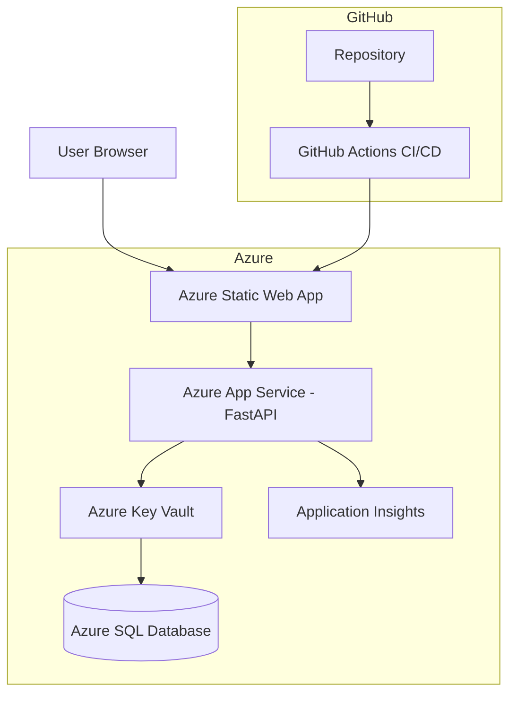

# Architecture Diagram

```mermaid
flowchart TD
    U[User Browser]

    subgraph Azure
        F[Azure Static Web App]
        B[Azure App Service - FastAPI]
        K[Azure Key Vault]
        D[(Azure SQL Database)]
        M[Application Insights]
    end

    subgraph GitHub
        R[Repository]
        C[GitHub Actions CI/CD]
    end

    U --> F
    F --> B
    B --> K
    K --> D
    B --> M
    R --> C
    C --> F
```
